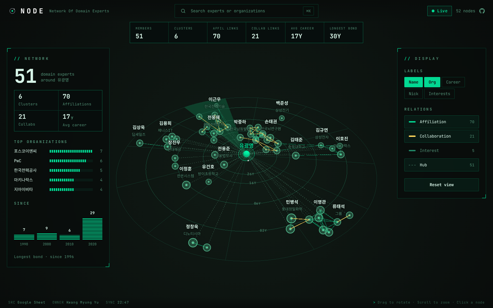

# NODE - Network Of Domain Experts

운영자 **유광명**을 중심 허브로, AI 도메인 전문가 52명(확장 가능)의 네트워크를 **인터랙티브 3D 지식그래프**로 탐색하는 **제로빌드 정적 웹 대시보드**입니다. 경력·소속·관심사를 바탕으로 전문가 사이의 관계를 추론해 시각화합니다.

빌드 도구·백엔드·DB 없이 `index.html`과 CSS, 바닐라 JS(ES Modules), CDN 라이브러리만으로 동작합니다. 데이터는 공개 Google Sheets에서 런타임에 CSV로 가져오고, 실패하면 저장소에 동봉한 스냅샷으로 자동 전환됩니다.

**▶ 라이브 데모: https://sguys99.github.io/node/**



- 요구사항 원천: [docs/PRD.md](docs/PRD.md)
- 개발 계획서: [docs/plan.md](docs/plan.md)
- 디자인 시스템(토큰): [DESIGN.md](DESIGN.md)

## 주요 기능

- **레이더 원반 그래프**: 허브(유광명)를 중심으로 알고 지낸 기간이 길수록 안쪽 궤도에 배치합니다. 연차 링(`02Y`·`06Y`·`16Y`·`26Y`)과 레이더 스윕이 원반 아래에 깔리고, 드래그 회전·스크롤 줌을 지원합니다.
- **관계 추론**: 소속 공유(현직장·과거 경력), 협업 이력, 관심사 2개 이상 중첩을 엣지로 자동 생성하고, 소속·협업 연결로 묶인 클러스터를 찾습니다.
- **KPI 스트립**: Members · Clusters · Affil/Collab Links · Avg Career · Longest Bond.
- **좌측 패널**: 미선택 시 네트워크 요약(상위 조직·연대 분포), 노드 선택 시 상세 정보와 Connections 목록. 목록 항목을 클릭하면 해당 노드로 이동합니다.
- **검색**: `⌘K` / `Ctrl+K` / `/`로 열고, 이름·닉네임·조직(현직장·과거 경력)으로 찾아 선택하면 그 노드로 fly-to합니다.
- **우측 설정**: 라벨 필드(Name·Org·Career·Nick·Interests)와 관계 유형(Affiliation·Collaboration·Interest·Hub) 표시 토글, Reset view.
- **출처 배지**: 시트 로드 성공 시 `Live`, 폴백 시 `Snapshot`. 둘 다 실패하면 재시도 버튼이 있는 에러 화면을 띄웁니다.

## 로컬 실행

ES Module과 `fetch`를 쓰므로 `file://`로 직접 열지 말고 정적 서버로 리포 루트를 서빙합니다.

```bash
python3 -m http.server 8000
# → http://localhost:8000
```

## 기술 스택

| 영역 | 기술 |
|---|---|
| 마크업/스타일 | HTML5, CSS (DESIGN.md 토큰을 CSS 변수로 매핑) |
| 로직 | 바닐라 JavaScript (ES Modules), 프레임워크·빌드 없음 |
| 그래프 | [3d-force-graph](https://github.com/vasturiano/3d-force-graph) + [Three.js](https://threejs.org/) + CSS2DRenderer + d3-force-3d — Command HUD 레이더 원반 레이아웃·Blip 노드·라벨 충돌 정리·fly-to (CDN ESM) |
| 테스트 | Node 22 내장 테스트 러너(`node --test`) — 순수 로직 단위 테스트, 설치·설정 없음 |
| CSV 파싱 | [PapaParse](https://www.papaparse.com/) (CDN) |
| 데이터 | Google Sheets 런타임 CSV fetch → 실패 시 `data/snapshot.csv` 폴백 |
| 배포 | 리포 루트 정적 파일 → GitHub Pages (빌드 없음) |

## 디렉토리 구조

```
/ (repo root, GitHub Pages 루트)
├── index.html          # 풀블리드 그래프 + HUD(헤더 검색·KPI·좌우 패널·상태줄), OG 메타, CDN <script>
├── css/
│   ├── tokens.css      # DESIGN.md 토큰 → CSS 변수 매핑
│   └── styles.css      # HUD 레이아웃·패널·반응형
├── js/
│   ├── main.js         # 부트스트랩 오케스트레이션 (엔트리)
│   ├── data.js         # CSV fetch·폴백·PapaParse 파싱
│   ├── normalize.js    # 동의어 맵·정규화·결측치 처리
│   ├── graph.js        # buildGraph(): 노드/엣지 모델 + 추론, findClusters()
│   ├── layout.js       # 원반 레이아웃 반경(인연 기간 → 궤도)
│   ├── stats.js        # KPI·네트워크 요약 통계
│   ├── labels.js       # 라벨 문구·충돌 배치
│   ├── search.js       # 검색 매칭·입력 바인딩
│   ├── render.js       # 3d-force-graph 구성·선택·fly-to·controller
│   ├── scene.js        # 배경·레이더 그리드·연차 링·스윕·블룸
│   ├── nodes.js        # Blip/허브 노드·라벨·선택 레티클
│   ├── camera.js       # 홈 시점·fly-to·인트로
│   └── panels.js       # KPI·좌측 요약/상세·우측 설정·상태줄
├── tests/              # node --test 단위 테스트
├── data/
│   └── snapshot.csv    # fetch 실패 시 폴백 스냅샷 (수동 갱신)
├── assets/
│   ├── logo/           # 브랜드 SVG(마크·가로/세로 락업·파비콘)
│   └── og/             # 링크 공유 카드(og-image.png + 렌더 소스 og-image.html)
├── docs/               # PRD·개발 계획서·리디자인 스펙
├── design-preview/     # 디자인 시안·결과 스크린샷 (런타임 미사용)
└── DESIGN.md           # 디자인 시스템(Command HUD 토큰·컴포넌트·3D 그래프 시각)
```

## 테스트

순수 로직(레이아웃 반경·클러스터·통계·라벨 배치·검색)은 Node 22 내장 테스트 러너로 검증합니다. 설치나 설정 파일은 필요 없습니다.

```bash
node --test
```

## 데이터 갱신 (Google Sheet)

데이터의 단일 진실 원천(SSOT)은 공개 Google Sheet입니다. 운영자가 시트의 행을 추가·수정하면 대시보드 새로고침 시 즉시 반영됩니다(별도 배포 불필요).

- CSV 엔드포인트(gviz): `https://docs.google.com/spreadsheets/d/1fychV7omFIle0GpBAF2_ccAyF0cZAtY7IFsmkIS5sic/gviz/tq?tqx=out:csv&gid=0`
- 폴백 스냅샷 `data/snapshot.csv`는 **수동 갱신**입니다. 주기적으로 위 엔드포인트의 CSV를 내려받아 동일 스키마로 커밋하세요.
- 시트 컬럼(11개): `번호, 이름, 닉네임, 협업 시점, 나이(경력), 현직장, 과거 경력, 하는일, 관심사, 희망사항, 협업`. `번호` 1은 허브(유광명), `협업 시점`은 유광명과 알게 된 연도입니다. `과거 경력`·`협업`은 콤마로 여러 값을 적습니다.

## 링크 공유 미리보기 (Open Graph)

카카오톡·슬랙 등에 링크를 붙이면 `assets/og/og-image.png`(1200×630)가 카드로 표시됩니다. 카드 디자인은 `assets/og/og-image.html`에 있고, 수정 후 chromium으로 캡처해 PNG를 다시 만듭니다.

```bash
npx playwright screenshot --browser chromium --viewport-size 1200,630 \
  --wait-for-timeout 2500 file://$PWD/assets/og/og-image.html assets/og/og-image.png
```

배포 URL이 바뀌면 `index.html`의 canonical·`og:url`·`og:image` 절대경로도 함께 고쳐야 합니다.

## 배포 (GitHub Pages)

빌드·GitHub Actions 없이 main 브랜치 루트를 GitHub Pages로 직접 서빙합니다.

1. GitHub 저장소 → **Settings → Pages**
2. **Source**: `Deploy from a branch`
3. **Branch**: `main` / **폴더**: `/ (root)` 선택 후 저장
4. 발급된 URL에서 정상 동작 확인

## 라이선스

Apache 2.0. [LICENSE](LICENSE) 참고.
